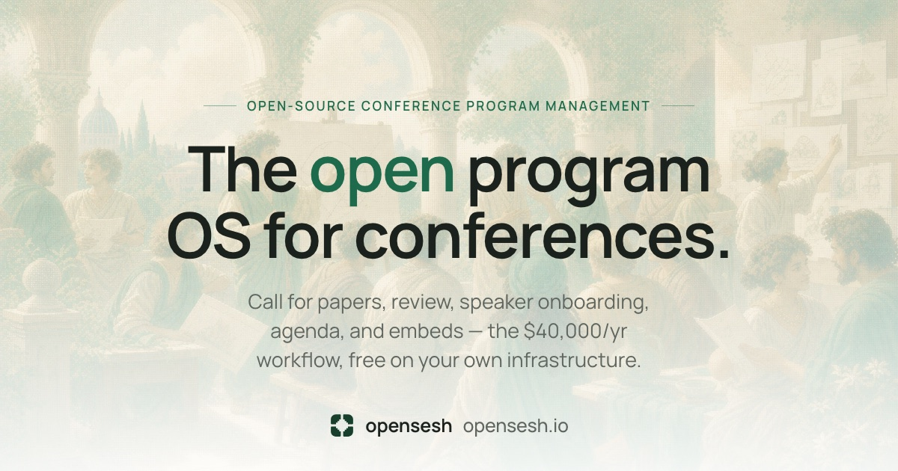

# opensesh

Open-source event program management — a full rebuild of Sessionboard's Program module for swyx's [Kill My SaaS](https://forge.smol.ai/swyx/killmysaas) challenge. CFP → review → speaker onboarding → content approval → agenda → public widgets, as one connected workflow.

[](https://app.opensesh.io)

**Live demo:** https://app.opensesh.io · **Site:** https://opensesh.io · **Docs:** https://docs.opensesh.io

## Try it in 30 seconds

Every page has a **Demo roles** button (bottom right) — one click signs you in as any persona, no credentials needed:

| Persona | Role | What to look at |
|---|---|---|
| Dana Organizer | Admin | Dashboard, review desk, content approval, tasks |
| Rey Reviewer | Reviewer | Evaluation queue (scoped to their tracks only) |
| Maya Chen | Speaker | Portal: edit an accepted talk → lands in Dana's approval queue; her bio edit is already pending there |
| Lina Haddad | Speaker | Portal task checklist mid-flight |
| Jamal Reed | Speaker | Missing bio — watch the readiness board notice |

Email+password sign-in also works for every persona (password is seeded for the demo: `demo-pass-2027`).

## The guided tour (rubric-mapped)

1. **CFP** — public wizard at [/submit/ai-engineer-nyc-2026/form_sessions](https://app.opensesh.io/submit/ai-engineer-nyc-2026/form_sessions): multi-step Linear-style flow, drafts with resume, conditional questions, submission limits, co-presenters. Organizer side: form builder, event creation, tracks/formats/rooms library CRUD under **Forms** and **Settings**.
2. **Abstract management** — **Abstracts** desk: status tabs, track/format/tag filters, column control, CSV export, bulk decisions; every row opens a Linear-style spotlight panel (j/k navigation, deep-linkable `?spotlight=` URLs, exact back semantics) with decision panel, review roll-up, activity, and email history. Accepting graduates the abstract to the **Sessions** desk.
3. **Evaluation** — **Evaluation**: reviewer queue with keyboard-first scoring (rating + comment + decision), scoped per reviewer; sign in as Rey to see the whole app collapse to just their queue.
4. **Speaker management** — **Speakers** directory: every speaker opens a consolidated spotlight — profile-readiness checklist, contact/logistics, linked sessions, tasks with waive, versioned files with download, email history (rows deep-link into the email viewer), and inline profile-change diffs with approve/reject. **Tasks**: templates with auto-assign-on-accept + a live readiness board.
5. **Content management** — **Content**: pending-change approval queue with field-level diffs, per-session speakers + versioned history with restore; **Portal Forms**: dedicated two-pane editor page with a live "what speakers see" preview (builder left, rendered form right); **File Requests** (versioned uploads with cross-role comment threads); session assets — accepted speakers upload slides/one-pagers against per-session requirements right in their portal, with versioning and organizer comment threads. Speaker edits to accepted sessions require organizer approval before they go public — the last approved version stays live.
6. **Agenda** — **Agenda**: day/room schedule builder with drag-and-drop, resize, an unscheduled pool, live room/speaker conflict detection (the seed plants a Hall A overlap — check the Conflicts tab), and an explicit draft → publish step; the public agenda renders only the last published snapshot.
7. **AI agenda** — **Agenda → AI drafts**: criteria (days/rooms/rules) → generate → full-width compare with per-row accept; the live agenda never changes until you accept. Uses Claude when an API key is configured, with a deterministic solver fallback and a conflict-free validation gate either way.
8. **Public widgets** — five public views under [/e/ai-engineer-nyc-2026](https://app.opensesh.io/e/ai-engineer-nyc-2026/sessions) (sessions, speakers, gallery, agenda, itinerary) rendered from the published snapshot + approved content only; **Widgets** builder with live preview, filters, theming, and copyable iframe code (`/embed/{id}`). Live data — no 60-minute cache. Speaker CSV import/export lives on **Speakers**.
9. **Emails** — **Email delivery**: transactional email with typed templates (acceptance/decline with feedback, task reminders, calendar invites with ICS attachments and reschedule sequencing), queue-backed sending with retries, and an in-app viewer with HTML preview and retry, so judges can verify sends without an inbox. **Communications**: campaigns with audience segments, merge tokens, per-recipient delivery tracking, and reusable templates. Every speaker email carries a tokened portal link — the email itself signs the speaker in, no password or second email.
10. **API + MCP** — a keyed REST API (`/v1`, keyset pagination) with a generated reference on [docs.opensesh.io](https://docs.opensesh.io), plus a built-in remote MCP server so agents can operate the program with user-scoped OAuth.

## Stack

- **App**: TanStack Start (full SSR) on Cloudflare Workers; TanStack Router/Query/Table
- **Data**: PlanetScale Postgres via Hyperdrive; Drizzle ORM; Effect for the domain layer (one DB round-trip per server function)
- **Files**: Cloudflare R2 (versioned uploads)
- **UI**: shadcn/ui (new-york-v4), Manrope, TipTap editor; design language documented in [docs/DESIGN.md](docs/DESIGN.md)
- **Monorepo**: `apps/web` (product) · `apps/landing` (marketing) · `apps/docs` (docs site) · `packages/domain` (schema, repos, seed) · `packages/email` (typed templates)

## Local development

```bash
docker run -d --name opensesh-pg -p 5433:5432 -e POSTGRES_PASSWORD=postgres postgres:18
pnpm install
# apps/web/.dev.vars: DATABASE_URL + BETTER_AUTH_SECRET
pnpm run db:reset   # migrate + seed + verify
pnpm dev            # http://localhost:3000
```

`pnpm check` runs formatting, lint, and typechecks across the workspace. Integration verifiers: `pnpm run cfp:verify`, `pnpm run review-desk:verify`, `pnpm run mail:verify` (note: they mutate seed state — run `db:reset` before each and after).

Every event surface — settings included — is real: **Settings** edits Basics/Schedule/Branding/Submissions with timezone-aware datetime pickers, and all dates across the app render in the event's timezone (SSR-safe).

## Docs

- [docs/PRD.md](docs/PRD.md) — product scope · [docs/SCHEMA.md](docs/SCHEMA.md) — data model
- [docs/DESIGN.md](docs/DESIGN.md) — the UI taste reference every surface follows
- [docs/specs/](docs/specs/) — work-package specs
